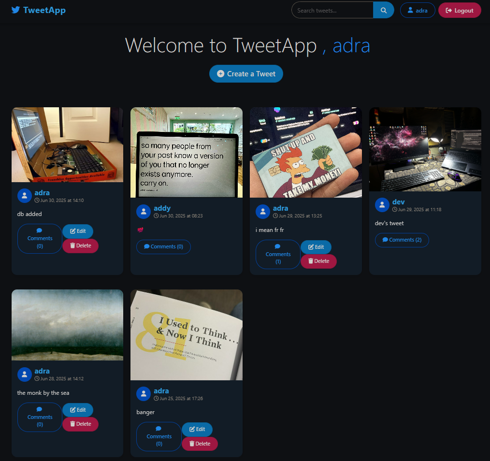

# TweetApp

A simple Twitter-like social media application built with Django.

<!--  -->


## Features

- User authentication (register, login, logout)
- Create, read, update, and delete tweets
- Image uploads with tweets
- Search functionality for tweets
- Responsive design

## Tech Stack

- Django 5.2.3
- Python 3.9+
- SQLite (development) / PostgreSQL (production)
- Pillow for image processing
- WhiteNoise for static files

## Installation

### Prerequisites
- Python 3.9+
- Git

> I've used uv, which is rust-based & 100x faster than pip
 
### Setup

1. Clone the repository
   ```bash
   git clone https://github.com/adityaxxz/tweet-app.git
   cd tweetapp
   ```

2. Create a virtual environment
   ```bash
   uv venv
   # On Windows
   .venv\Scripts\activate
   # On macOS/Linux
   source .venv/bin/activate
   ```

3. Install dependencies
   ```bash
   uv pip install -r requirements.txt
   ```

4. Run migrations
   ```bash
   python manage.py migrate
   ```

5. Create a superuser (admin)
   ```bash
   python manage.py createsuperuser
   ```

6. Run the development server
   ```bash
   python manage.py runserver
   ```

7. Access the application at `http://127.0.0.1:8000`

## Environment Variables

Create a `.env` file in the project root with the following variables:

```
SECRET_KEY=your_secret_key
DEBUG=True
DATABASE_URL=sqlite:///db.sqlite3
```

For production, update these values appropriately.

## Deployment

### Deploying to a Server

1. Set up a production-ready database (PostgreSQL recommended)
2. Configure environment variables for production
3. Collect static files:
   ```bash
   python manage.py collectstatic
   ```
4. Use Gunicorn as the WSGI server:
   ```bash
   gunicorn tweetapp.wsgi:application
   ```

### Deploying to Vercel

1. Install Vercel CLI
   ```bash
   npm install -g vercel
   ```

2. Login to Vercel
   ```bash
   vercel login
   ```

3. Deploy the app
   ```bash
   vercel
   ```

4. For production deployment
   ```bash
   vercel --prod
   ```

Set these environment variables in your Vercel project settings:
- `SECRET_KEY`: Your Django secret key
- `DEBUG`: Set to 'False' for production
- `DATABASE_URL`: Your PostgreSQL connection string


## License

This project is licensed under the MIT License - see the LICENSE file for details.

## Acknowledgements

- Django documentation (https://docs.djangoproject.com/)
- Bootstrap for UI components (https://getbootstrap.com/)
- Contributors and maintainers (https://github.com/adityaxxz/tweet-app/graphs/contributors)

